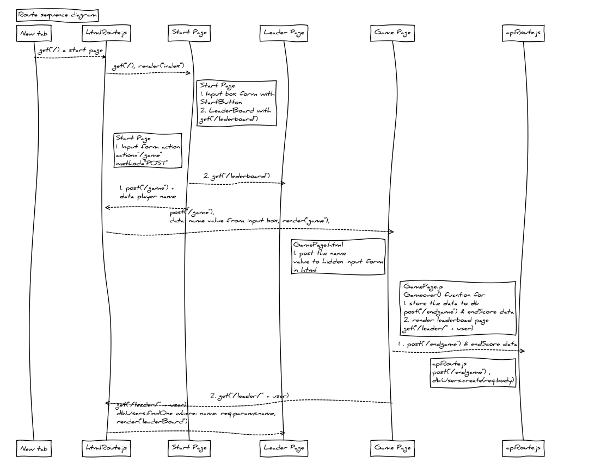

# Netscape

## Table of contents

- [General info](#general-info)
- [Technologies](#Technologies)
- [Deployment](#Deployment)
- [Code Overview](#Code-Overview)
- [JavaScript Game Function explain](#JavaScript-Function-explain)
- [CSS style](#CSS-style)
- [Beck-end Server Route](#Beck-end-Server-Route)

## General info

This is mini online game that you can compete high score with everyone online. Goals is to collet as much coins and kill as much monsters in shortest time. Your score will display on the leader board if you are the top 20. You can also see the top5 life data while you are in the game

Game Link: https://morning-reaches-86959.herokuapp.com/


## Technologies

Project is created with:

- [JavaScript](https://www.javascript.com/)
- [JQuery](https://jquery.com/)
- [Bootstrap](https://getbootstrap.com/)
- [Node.js](https://nodejs.org/)
- [Express.js](https://expressjs.com/)
- [MySql](https://www.mysql.com/)
- [moment.js](https://momentjs.com/)
- [Phaser 3](https://phaser.io/phaser3)
- [Tiled (Map builder)](https://www.mapeditor.org/)
- [Handlebars](https://handlebarsjs.com/)

## Deployment

Download the repository

- In your terminal, cd to the netscape folder directory, `$npm i`
- In you local mySql: use the schema provide in models folder, create Database
- Enter your mySql connection info (under "test" section) in config.js under config folder
- To run on electron: `$npm run electron`
- To run on browser: `$node server.js`

## Code Overview

### Summary

- Using electron run express server and handlebars. [Link to quick start guilds](https://github.com/joshjcarrier/electron-express-quick-start)
- Tiled & Phaser 3 to run game engins
- Bootstrap, handlebars for front end templete
- mySql for database connection
- node.js to run and management models

## JavaScript Game Function explain

## CSS style

## handlebars

#### Here the code to run different css style for different page

```
// in your server side

 app.post("/game", function(req, res) {
    res.render("game", {
      // data to pass to handlebars go here
      style: "gamestyle.css",
      dataValue: req.body
    });
  });

// in your main.handlebars head section

 <link href="/assets/styles/{{style}}" type="text/css" rel="stylesheet" />
```

#### Here the code handlebars show part of html only the if there is current user

```
<!-- in your leaderboard.handlebar -->

{{!-- This code run when there is user score --}}
{{#if finalScore.bestTime}}
<div class="container">
    <h2>{{finalScore.name}}, your Best Time is {{finalScore.bestTime}}s</h2>
    <h2>Your Coins Collected is: {{finalScore.treasurePoint}} coins</h2>
    <h2>Humber of Monsters Killed: {{finalScore.monstersKilled}} </h2>
</div>
{{/if}}

```

## Beck-end Server Route



```sequence {theme="hand"}
Title: Route sequence diagram

New tab-->htmlRoute.js: get("/) a start page

htmlRoute.js-->>Start Page: get("/), render("index")

Note right of Start Page: Start Page \n 1. Input box form with \n StartButton\n 2. LeaderBoard with \n get("/lederboard")

Note left of Start Page: Start Page \n 1. Input form action \n action="/game" \n method="POST"
Start Page-->> Leader Page:2. get("/lederboard")

Start Page-->> htmlRoute.js: 1. post("/game") + \n data player name

htmlRoute.js-->>Game Page:post("/game"), \n data: name value from input box, render("game"),

Note left of Game Page: GamePage.html \n 1. post the name  \n value to hidden input form \n in html

Note right of Game Page: GamePage.js \n Gameover() fucntion for \n 1. store the data to db \n $.post("/endgame") & endScore data \n 2. render leaderboad page \n  $.get("/leader/" + user)

Game Page-->> apiRoute.js:1 . $.post("/endgame") & endScore data

Note left of apiRoute.js : apiRoute.js \n post("/endgame") , \n db.Users.create(req.body)

Game Page-->> htmlRoute.js: 2. $.get("/leader/" + user)

htmlRoute.js-->>Leader Page: get("/leader/" + user) \n db.Users.findOne where: name: req.params.name,\n render("leaderBoard")

```
